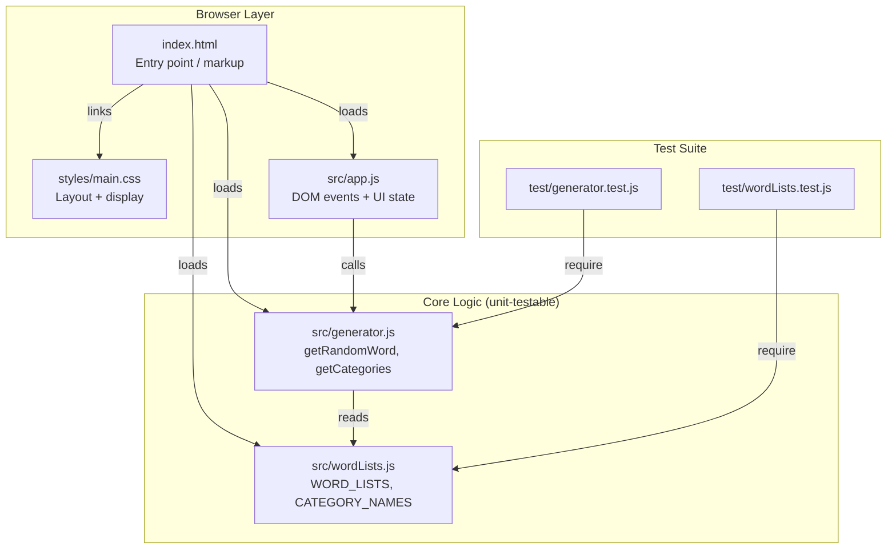
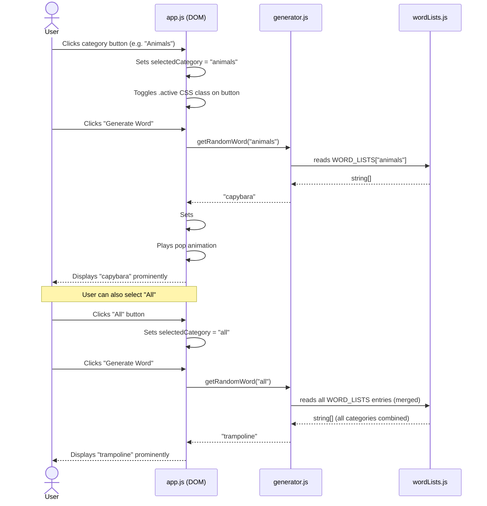

# Improv Word Generator

A single-page Vanilla JS website that generates a random word on demand, organized by category, for use in improv theatre exercises.

## Features

- **10 word categories**: Places, Transportation, Food, Not Food, Animals, Occupations, Emotions, Actions, Characters, Time Periods
- **"All" wildcard** — draws from the entire combined word pool
- **Single-category selection** — click any category button to filter words, then click **Generate Word**
- No build step — open `index.html` directly in a browser
- Full unit test suite via Jest

---

## Getting Started

```bash
# Install test dependencies
npm install

# Run tests
npm test

# Run tests with coverage report
npm run test:coverage
```

To use the app, open `index.html` in any modern browser — no server required.

---

## Architecture

### Module Overview

| File | Role |
|---|---|
| `src/wordLists.js` | Pure data — `WORD_LISTS` object and `CATEGORY_NAMES` array |
| `src/generator.js` | Pure logic — `getRandomWord(category)`, `getCategories()` |
| `src/app.js` | DOM wiring — builds buttons, handles clicks, updates display |
| `styles/main.css` | Layout and styling |
| `index.html` | App shell — loads scripts in dependency order |
| `test/generator.test.js` | Unit tests for generator logic |
| `test/wordLists.test.js` | Data integrity tests for word lists |

### Component Diagram



### User Interaction — Sequence Diagram



---

## Word Categories

| Category | Key | Example Words |
|---|---|---|
| Places | `places` | library, airport, jungle, volcano, lighthouse |
| Transportation | `transportation` | bicycle, submarine, hot air balloon, zeppelin |
| Food | `food` | spaghetti, mango, croissant, kimchi, pretzel |
| Not Food | `objects` | stapler, umbrella, trampoline, periscope |
| Animals | `animals` | capybara, platypus, narwhal, axolotl, quokka |
| Occupations | `occupations` | beekeeper, astronaut, mime, taxidermist |
| Emotions | `emotions` | jealousy, nostalgia, panic, euphoria |
| Actions | `actions` | juggling, whispering, somersaulting |
| Characters | `characters` | pirate, wizard, detective, vampire, jester |
| Time Periods | `timePeriods` | medieval, 1920s, post-apocalyptic, Victorian |

---

## API Reference

### `getRandomWord(category)` → `string`

Returns a random word from the specified category.

- `category` — a category key string (e.g. `"places"`) or `"all"` for any category
- Throws `TypeError` if `category` is not a string
- Throws `RangeError` if `category` is an unrecognized key

### `getCategories()` → `string[]`

Returns an array of all 10 valid category key strings. Does not include `"all"`.

---

## License

MIT
